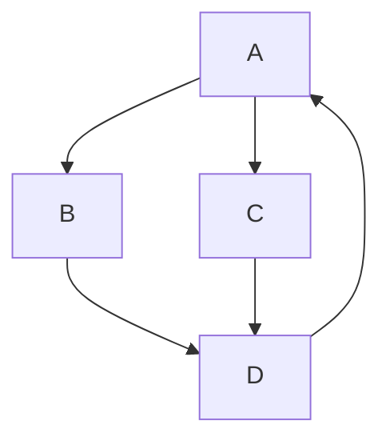
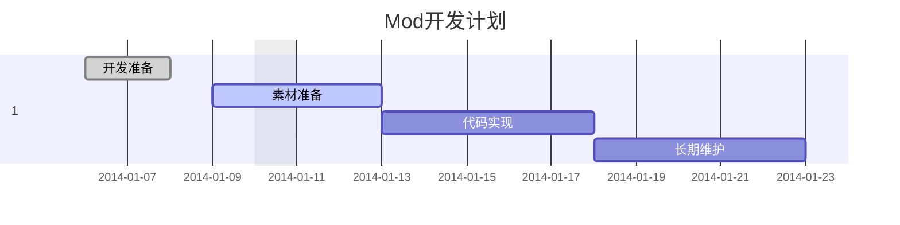
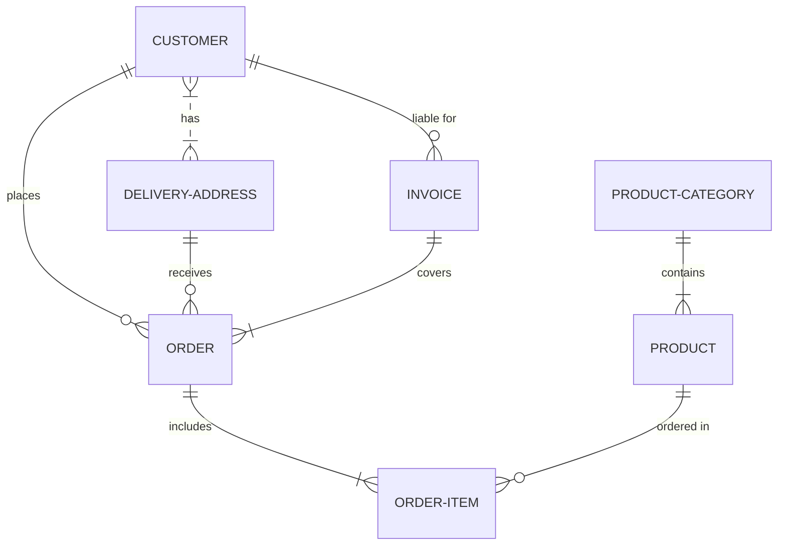
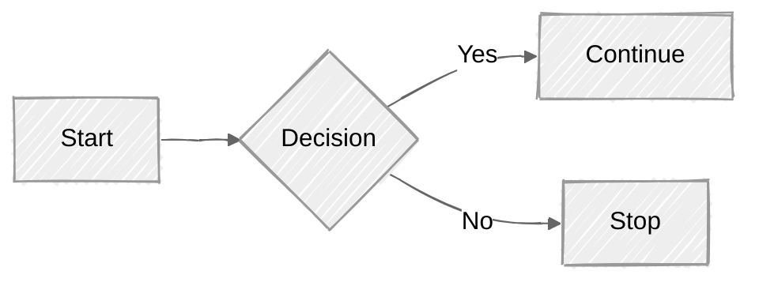
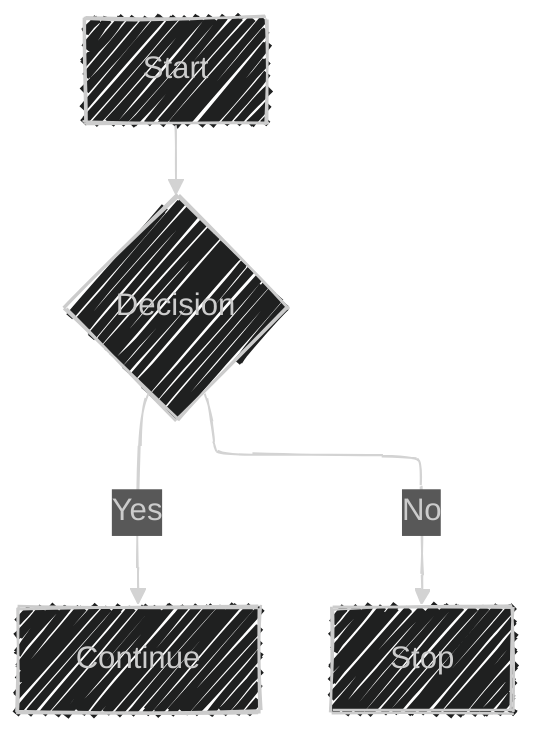

## Mermaid

基本流程

```mermaid
graph TD;
   A-->B;
   A-->C;
   B-->D;
   C-->D;
   D-->A
```

```mermaid
gantt
dateFormat  YYYY-MM-DD
title Mod开发计划
excludes weekdays 2014-01-10

section 1
开发准备            :done,    des1, 2014-01-06,2014-01-08
素材准备               :active,  des2, 2014-01-09, 3d
代码实现               :         des3, after des2, 5d
长期维护               :         des4, after des3, 5d

```

```mermaid
erDiagram
         CUSTOMER }|..|{ DELIVERY-ADDRESS : has
         CUSTOMER ||--o{ ORDER : places
         CUSTOMER ||--o{ INVOICE : "liable for"
         DELIVERY-ADDRESS ||--o{ ORDER : receives
         INVOICE ||--|{ ORDER : covers
         ORDER ||--|{ ORDER-ITEM : includes
         PRODUCT-CATEGORY ||--|{ PRODUCT : contains
         PRODUCT ||--o{ ORDER-ITEM : "ordered in"

```

```mermaid
---
config:
 look: handDrawn
 theme: neutral
---
flowchart LR
 A[Start] --> B{Decision}
 B -->|Yes| C[Continue]
 B -->|No| D[Stop]

```

```mermaid
---
config:
 layout: elk
 look: handDrawn
 theme: dark
---
flowchart TB
 A[Start] --> B{Decision}
 B -->|Yes| C[Continue]
 B -->|No| D[Stop]

```
