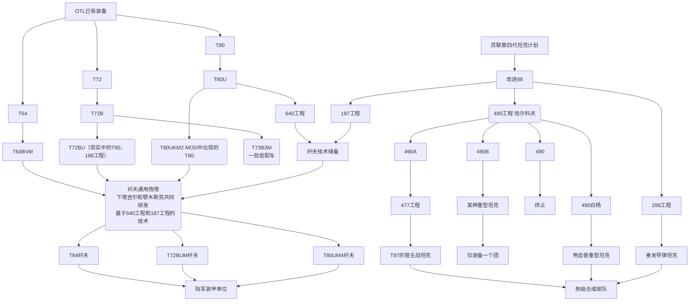
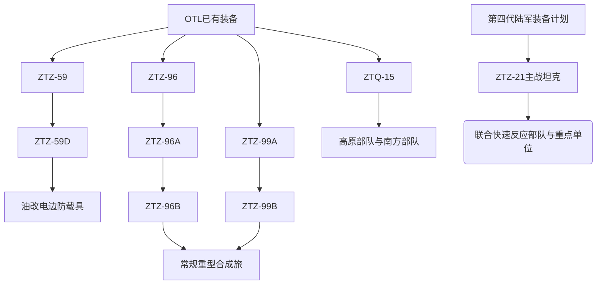

## 苏系坦克 II世界观

```mermaid
graph TD;
    OTL已有装备-->T72
    OTL已有装备-->T80
    OTL已有装备-->T64

   T64-->T64BVM-->纤夫-->T64纤夫;

   T72
   -->T72B
   -->T72BU(T72BU（现实中的T90，188工程）)
   -->纤夫(纤夫通用炮塔
   下塔吉尔和鄂木斯克共同研发
   基于640工程和187工程的技术)
   -->T72BUM纤夫;

    T72B--> T73B3M(T73B3M
     一批低配车)


   T80-->T80U-->T80UKM2(T80UKM2 MOD中出现的T80)-->纤夫-->T80UM4纤夫;

    T64纤夫--> 陆军装甲单位
    T72BUM纤夫--> 陆军装甲单位
    T80UM4纤夫--> 陆军装甲单位


       T80U --> 640工程 --> 纤夫技术储备
   490工程-->490A-->477工程
   477工程-->T97灰狼主战坦克-->旅级合成部队

   490工程-->490B-->某种重型坦克-->仅装备一个团
   490工程-->490-->终止
   490工程-->490白杨-->熊齿兽重型坦克-->旅级合成部队


      苏联第四代坦克计划-->
   改进88-->490工程(490工程 哈尔科夫)
   改进88-->187工程 --> 纤夫技术储备 -->纤夫


   改进88-->299工程 --> 垂发导弹坦克-->旅级合成部队
```

## 中系坦克 II世界观

```mermaid
graph TD;
    OTL已有装备-->ZTZ-59 --> ZTZ-59D -->油改电边防载具
    OTL已有装备-->ZTZ-96 --> ZTZ-96A--> ZTZ-96B --> 常规重型合成旅
    OTL已有装备-->ZTZ-99A-->ZTZ-99B--> 常规重型合成旅;
    OTL已有装备-->ZTQ-15 --> 高原部队与南方部队

    第四代陆军装备计划 --> ZTZ-21主战坦克 --> 精锐(联合快速反应部队与重点单位)


```
