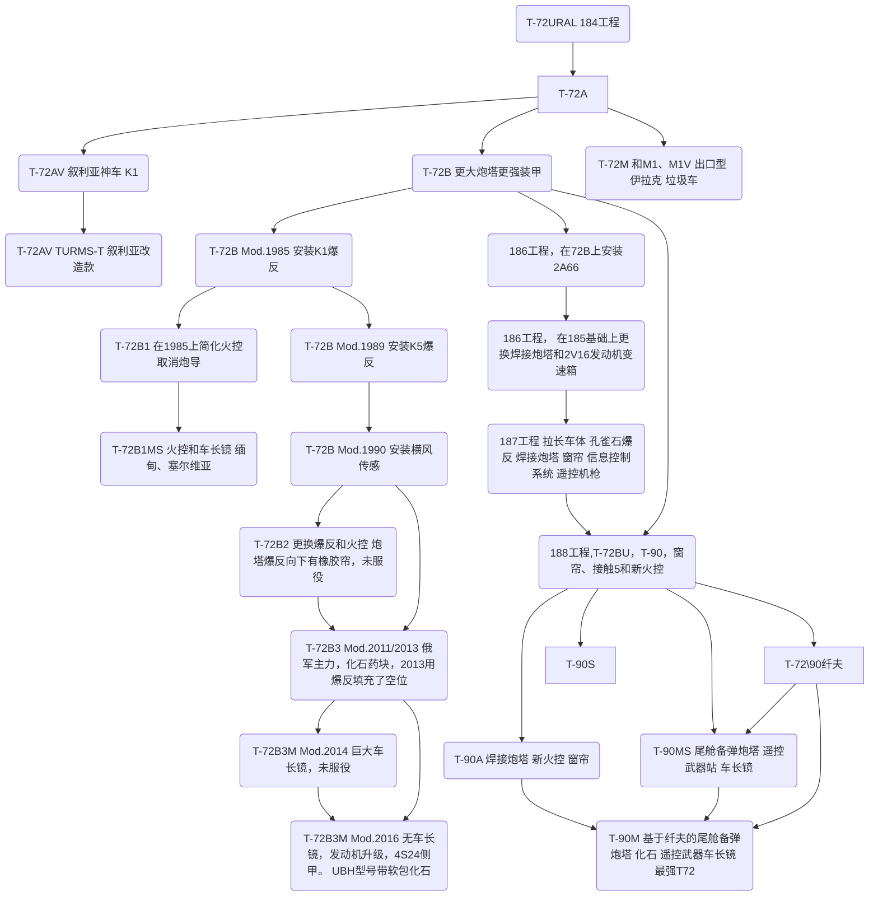
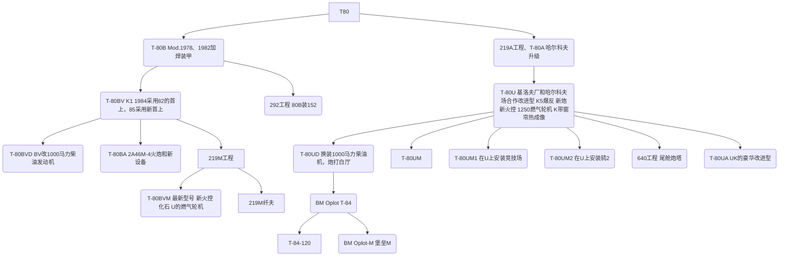
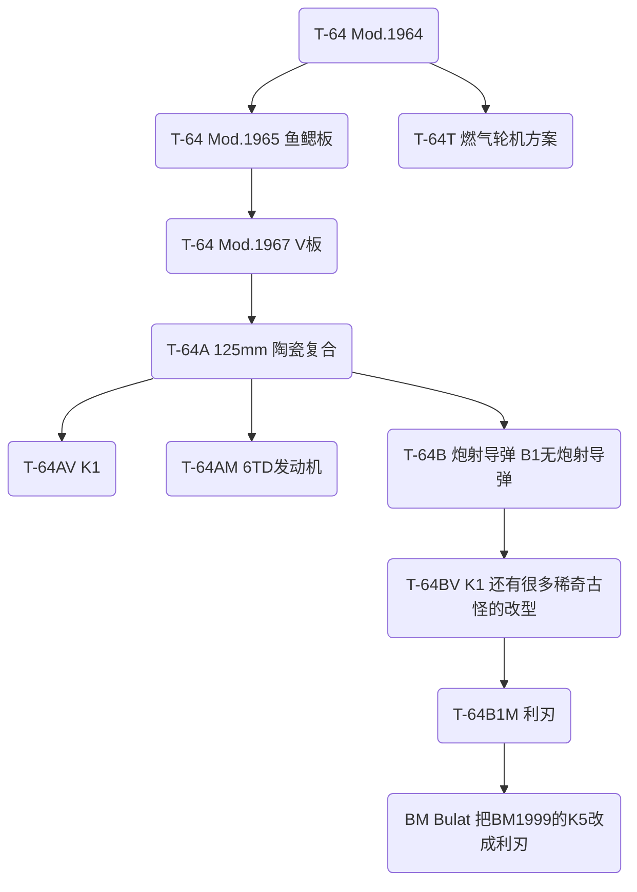
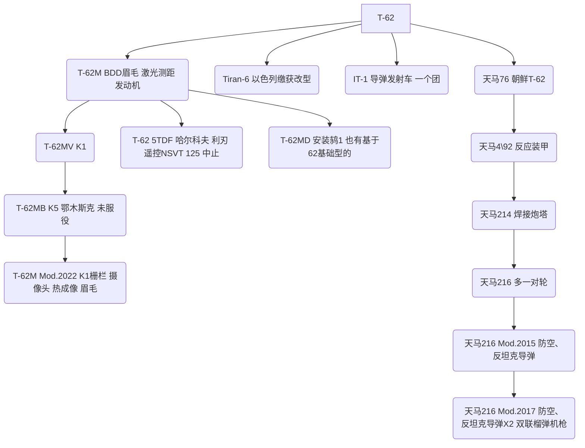

本文采用Mermaid的流程图编写，请按图标右上方的眼睛标识以全屏浏览。

## T-72简易谱系 OTL

## T-80简易谱系 OTL

## T-64简易谱系 OTL

## T-62简易谱系 OTL

## 参考资料

进击的超级Sherman：
https://www.bilibili.com/opus/672246580529594403/
https://www.bilibili.com/opus/680515071117361168/
https://www.bilibili.com/opus/745287670567010310/
https://www.bilibili.com/opus/771980900938285173/
有大幅度的简化。
